# IDS-Snort-Project
#  Snort IDS - Deployment & Packet Analysis

##  Project Overview
This project demonstrates the deployment of Snort as an Intrusion Detection System (IDS) to detect malicious network traffic. Attacks were generated from Kali Linux and analyzed using Wireshark to understand how attacks appear at the network layer.

##  Architecture
- Kali Linux (Attacker) → Ubuntu (Snort IDS) → Alerts Logged
- Network: 192.168.1.0/24

##  Tools Used
- Snort - Intrusion Detection System
- Kali Linux - Generate attacks
- Ubuntu - Snort deployment
- Wireshark - Packet analysis
- tcpdump - Packet capture
- Netcat (nc) - Port scanning

##  Snort Rules Created
File: /etc/snort/rules/local.rules

Rule 1: ICMP Ping Detection
alert icmp any any -> $HOME_NET any (msg:"ICMP Ping Detected"; sid:1000001; rev:1;)

Rule 2: Port 4444 Detection
alert tcp any any -> $HOME_NET 4444 (msg:"Port 4444 Connection"; sid:1000002; rev:1;)

##  Attacks Generated from Kali
- ICMP Ping: ping 192.168.1.122 -c 5
- Port 4444: nc -zv 192.168.1.122 4444

##  Snort Alerts Triggered
[**] [1:1000001:1] ICMP Ping Detected [**]
[**] [1:1000002:1] Port 4444 Connection [**]

Snort Command Used:
sudo snort -A console -l /var/log/snort -i enp0s3 -c /etc/snort/snort.conf -q

## Wireshark Analysis

### ICMP Traffic (Ping)
Filter: icmp
Source: 192.168.1.117 (Kali) → Destination: 192.168.1.122 (Ubuntu)
Protocol: ICMP
Type: Echo Request / Echo Reply
What It Shows: Attacker checking if target host is alive (reconnaissance).

### TCP SYN Packet (Port 4444)
Filter: tcp.port == 4444
Source: 192.168.1.117 (Kali) → Destination: 192.168.1.122:4444
Protocol: TCP
Flags: SYN (Connection attempt)
What It Shows: Attacker attempting to connect to port 4444 (port scanning/attack).

##  Screenshots

1. Snort Installation

2. Setting HOME_NET
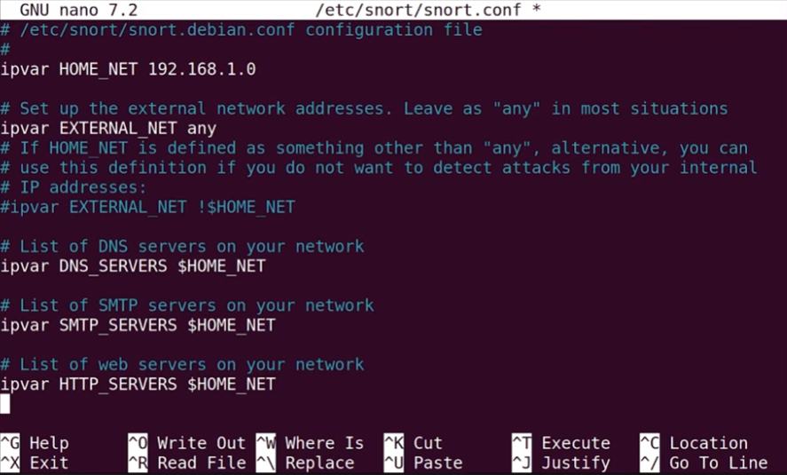

3. Local Rules File
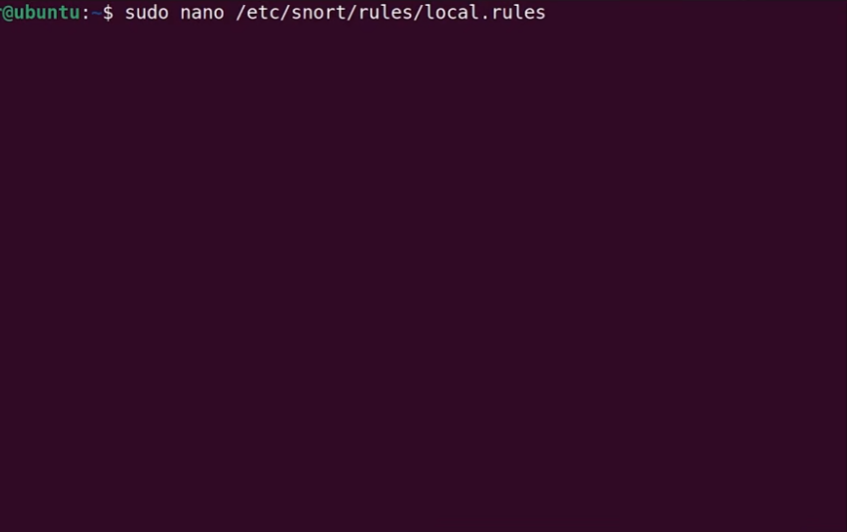

4. First Rule - Ping
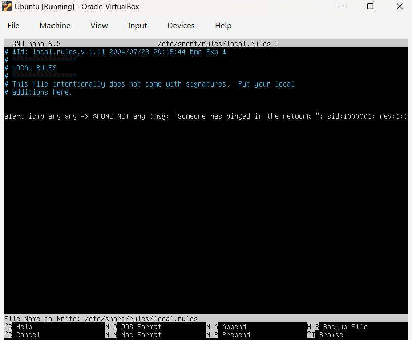

5. Second Rule - Port
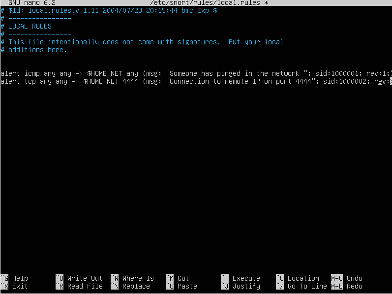

6. Install Wireshark
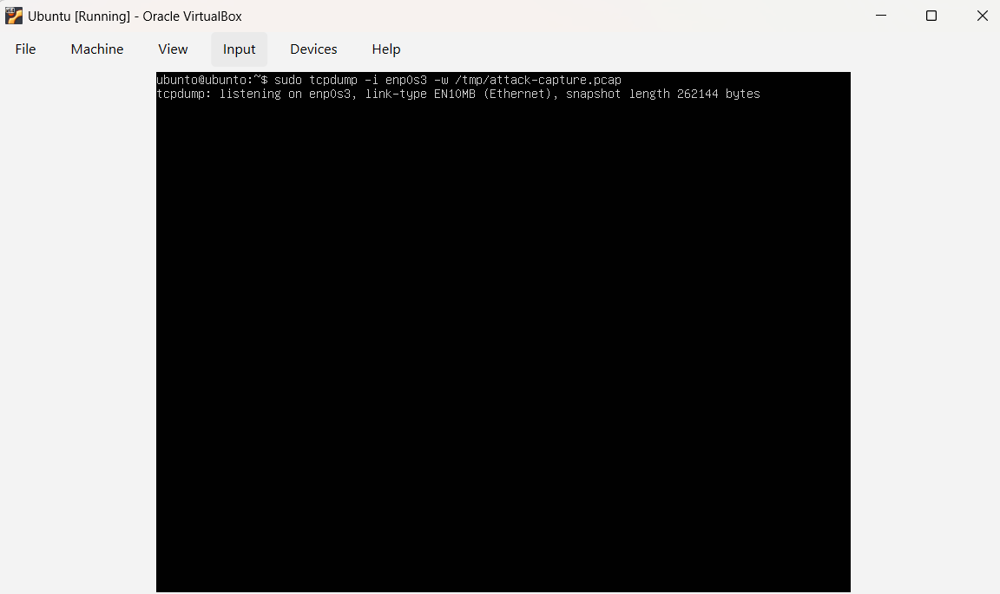

7. Ping from Kali to Ubuntu
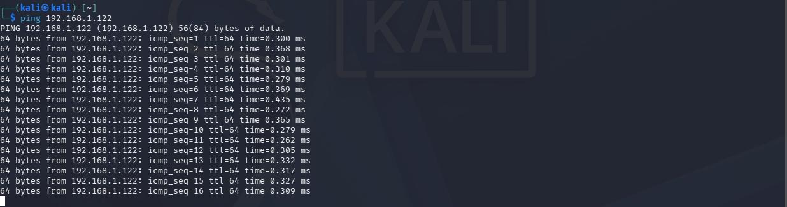

8. Check Port from Kali
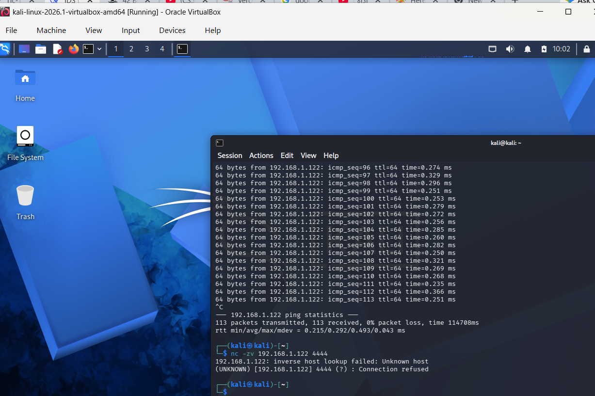

9. Snort Running - Ping Alert
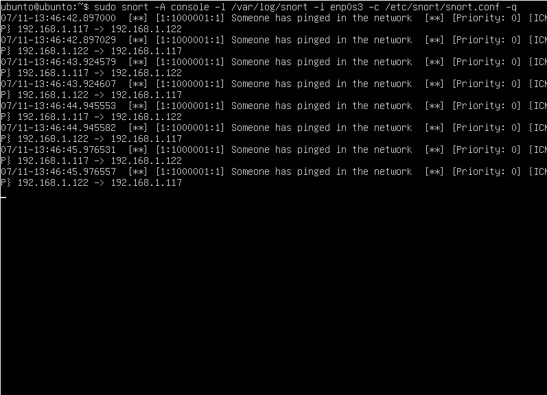

10. Snort Running - Port Alert
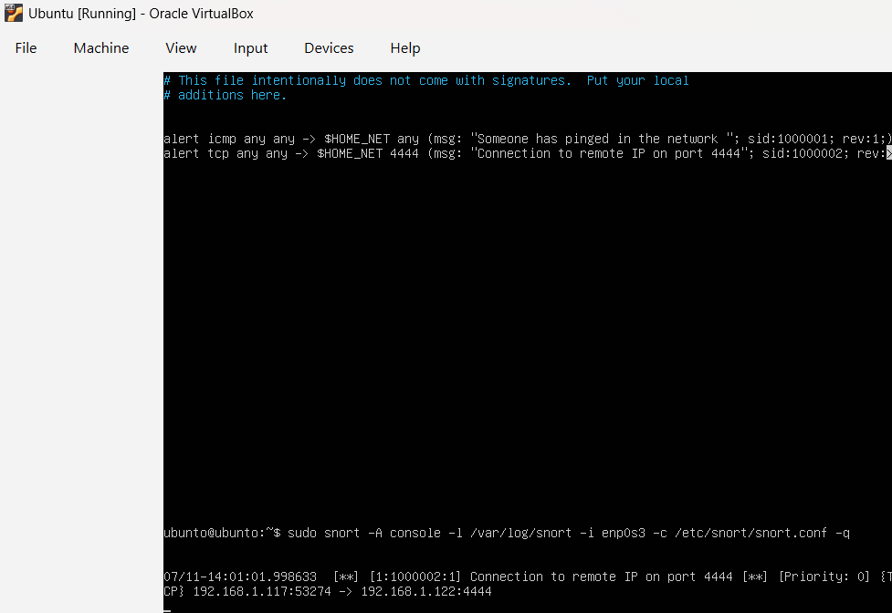

11. Wireshark - Ping Analysis
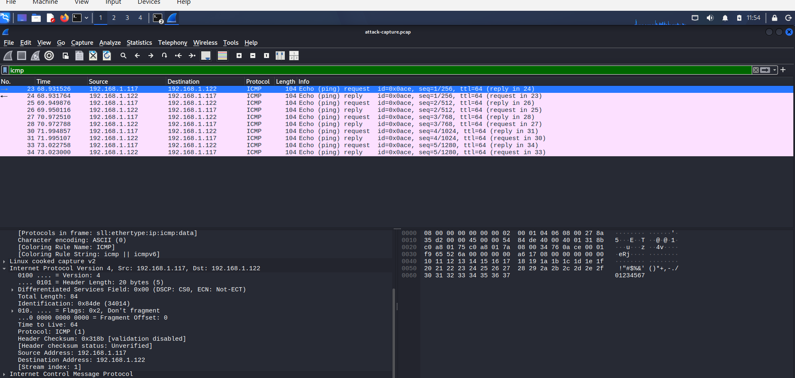

12. Wireshark - Port Analysis
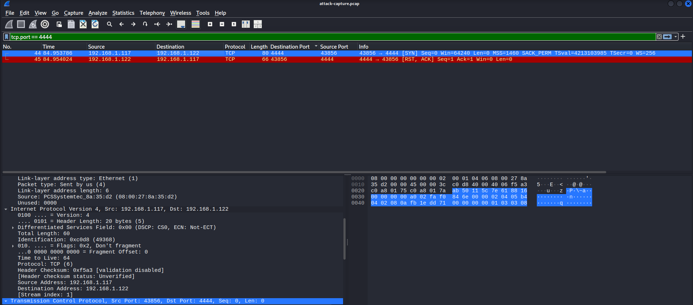

##  Key Learnings

How Attacks Appear at Network Layer:
- Ping Scan: ICMP Echo Requests → Protocol: ICMP
- Port Scan: TCP SYN packets → Flags: SYN
- Connection Attempt: TCP SYN to specific port → Destination Port

Lessons Learned:
- Snort detects attacks in real-time
- Custom rules are essential for specific threats
- Wireshark provides deep packet visibility
- Attacks leave clear signatures at packet level

##  Project Files
- local.rules - Snort custom rules
- attack-capture.pcap - Packet capture of attacks
- screenshots/ - All project screenshots

##  References
- Snort Documentation: https://www.snort.org/documents
- Wireshark Documentation: https://www.wireshark.org/docs/
- Kali Linux Tools: https://www.kali.org/tools/

##  Author
Hassan Fakheraldin
Date: July 2026

##  License
This project is for educational purposes only.
